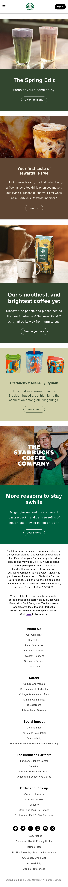

# Starbucks Landing Page (Clone)

## About

This project is a responsive clone of the Starbucks landing page.

This is also the 2nd static website that I've developed inorder to apply the learnings, of HTML and CSS, as a newbie in Web Development.

## Technologies Used

- HTML5
- CSS3

## Live Demo

Click here to visit the clone that I've deployed using netlify: **[Starbucks Landing Page Clone](https://coffee-starbuck-clone.netlify.app/)**

## Preview

#### Desktop

#### Mobile

